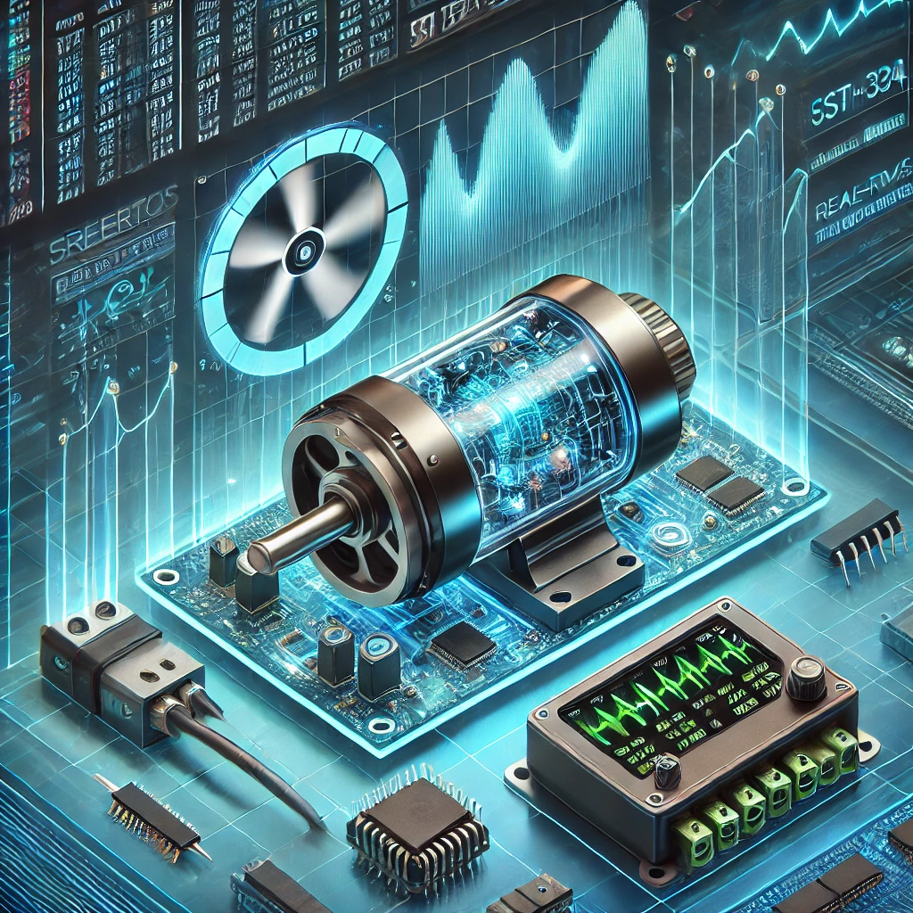

📅BLDC 韌體優化專案（RTOS & ISR 時序整合與 FOC 調校）



```
📢專案概述
本專案專注於優化 BLDC 馬達控制韌體，解決 FreeRTOS 與 ISR 時序整合的即時性問題。

👉主要目標包括：
📌確保 ISR 具有較高優先權，可即時中斷 RTOS 任務。
📌優化 20kHz 電流控制迴路，提升控制精度與響應速度。
📌PID 參數調校，確保馬達響應快速且穩定。
📌改進 FOC（Field-Oriented Control）演算法，降低扭矩漣波並提升轉速上限。
📌整合 CAN Bus 與 Encoder 訊號時序，防止時序誤差影響控制運行。
本專案基於 ST EVK STSPIN32G4 硬體平台 並運行 FreeRTOS。

📂目錄結構
BLDC_Firmware_Optimization/
│
├── docs/                      # 專案文件
│   ├── SPEC-001.adoc          # 專案規格書
│   ├── architecture/          # 系統架構與 UML 圖
│   ├── tuning/                # PID 調校與 FOC 優化文件
│   ├── test_reports/          # 測試報告（HIL, 模擬, 韌體測試）
│   ├── README.md              # 文件總覽
│
├── firmware/                  # 核心韌體
│   ├── src/                   # 韌體原始碼（ISR, RTOS 任務, 控制邏輯）
│   ├── include/               # 頭文件
│   ├── Makefile               # 編譯系統
│
├── test/                      # 測試框架
│   ├── unit_tests/            # 單元測試
│   ├── simulation/            # MATLAB/Python 模擬測試
│   ├── hil_tests/             # 硬體迴路測試（HIL）
│
├── tools/                     # 工具與腳本
│   ├── log_analyzer.py        # 韌體 log 分析工具
│   ├── pid_tuning_tool.py     # PID 自動調校工具
│
├── scripts/                   # 自動化編譯與部署腳本
│   ├── build_firmware.sh      # 韌體編譯腳本
│   ├── flash_firmware.sh      # 燒錄韌體腳本
│   ├── run_tests.sh           # 自動測試執行腳本
│
├── hardware/                  # 硬體文件（電路圖、PCB 設計）
│
└── README.md                  # 本文件


💻環境設置
🔧必備工具
📌STM32CubeIDE 或 GNU ARM Toolchain 進行韌體開發。
📌ST-Link Utility 用於燒錄韌體。
📌FreeRTOS 核心 已整合至專案中。
📌MATLAB/Simulink 或 Python 進行模擬測試。
📌示波器/邏輯分析儀 監測 ISR 時序準確性。

🟢開發環境設定

🟢複製此專案：
git clone https://github.com/luciferyu666/BLDC_Firmware_Optimization.git
cd BLDC_Firmware_Optimization

🟢安裝相依套件：
sudo apt-get install gcc-arm-none-eabi gdb-multiarch openocd

🟢開啟專案於 STM32CubeIDE 或使用 Makefile 進行編譯。

🟢韌體編譯與燒錄
編譯韌體
執行以下指令進行編譯：
cd firmware
make clean && make all

🟢燒錄韌體
將韌體燒錄至 STSPIN32G4 板：
scripts/flash_firmware.sh

🟢除錯模式
使用 OpenOCD 進行除錯：
openocd -f interface/stlink.cfg -f target/stm32g4x.cfg

然後在另一個終端執行：
gdb-multiarch firmware/build/main.elf -x scripts/debug.gdb

🟢測試方式
📌單元測試
執行單元測試：
cd test/unit_tests
make test
📌硬體迴路測試（HIL）
在實際馬達環境下測試韌體：
cd test/hil_tests
./hil_test_main
📌模擬測試
在 MATLAB 或 Python 中執行模擬測試：
cd test/simulation
matlab -r "run('matlab_simulation.m')"
# 或
python python_simulation.py

🟢授權
本專案採用 MIT 授權條款，詳見 LICENSE 文件。
```
